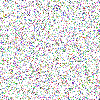
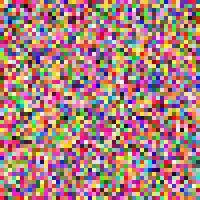
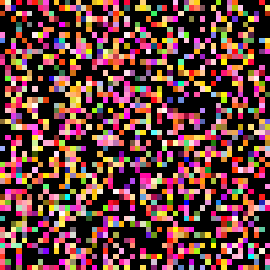

## Problem
The PNG supports 4 channels called `RGBA`, and we usually use the alpha channel for opacity.
But there is a different usecase to the alpha channel, the emissive intensity. The finally color will be added to the `emissive color * emissive intensity`.
In the fragment shader it would look like:
```glsl
precision mediump float;
uniform sampler2D texture;
varying vec2 uv;
void main () {
  vec4 color = texture2D(texture, uv);
  vec3 emissiveColor = vec3(1, 0, 0); // let red be the emissive color
  gl_FragColor = vec4(color.rgb + color.a * emissiveColor, 1);
}
```

Let's generate a PNG image to render.
```js
const ndarray = require('ndarray');
const savePixels = require('save-pixels');

const width = 100;
const height = 100;
const image = ndarray(new Uint8Array(width * height * 4), [width, height, 4]);
for (let i = 0; i < width; i++) {
  for (let j = 0; j < height; j++) {
    const r = Math.floor(Math.random() * 0x100);
    const g = Math.floor(Math.random() * 0x100);
    const b = Math.floor(Math.random() * 0x100);
    // 50% probability to generate non-zero emissive intensity
    const a = Math.random() > 0.5 ? 0 : Math.floor(Math.random() * 0x100);
    image.set(i, j ,0, r);
    image.set(i, j ,1, g);
    image.set(i, j ,2, b);
    image.set(i, j ,3, a);
  }
}

savePixels(image, 'png').pipe(process.stdout);
```

Save the code to `random-png.js`, and run `npm i ndarray save-pixels` to install dependencies.
Run `node random-png.js > random.png` to get the `random.png`.

The below tables show the results in different browsers.
<table style="text-align: center;">
  <tr>
    <th>Original</th>
    <th>Your browser</th>
    <th>macOS Chrome</th>
    <th>macOS Safari</th>
    <th>iOS Safari</th>
  </tr>
  <tr>
    <td></td>
    <td><canvas id="texture-canvas" style="width:100px;height:100px;"></td>
    <td></td>
    <td></td>
    <td></td>
  </tr>
</table>
<script language="javascript" src="https://npmcdn.com/regl/dist/regl.js"></script>
<script language="javascript" src="render-png.js"></script>

The result of `iOS Safari` seems so different, all pixels with 0 alpha become black.
It seems iOS Safari did the wrong premultiplication on images.

## Solutions
Is there any way to solve the problem?
Yes, I came up with 3 solutions:
1. Do not do this. If you want 4 channels and alpha channel is not for opacity, then just use two textures.
2. Do not use image, you can put image data into a binary file and read it as a `Uint8Array` and load it into a texture.
3. Use a PNG decoder to directly decode the image, then you can get a clear image data.
